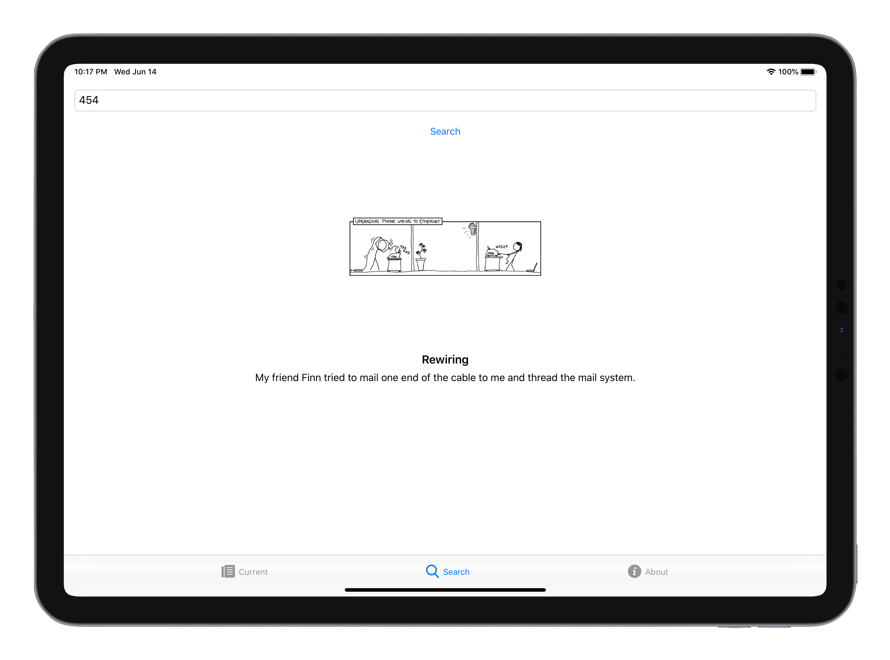
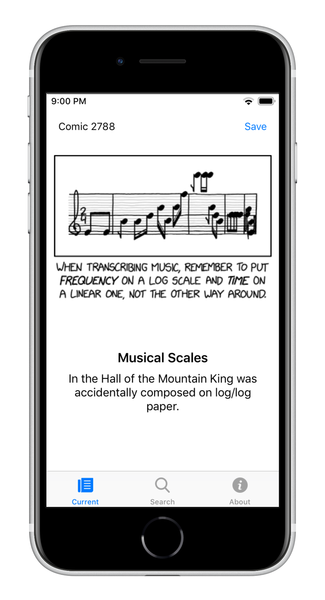

# xkcd

**xkcd-viewer** is a simple iOS application written in UIKit that allows you to browse and search for XKCD comics.



## Features

- View the latest XKCD comic
- Search for XKCD comics by comic number
- Save your favorite comics to the photo gallery

## Requirements

- iOS 11.0 to 15.7
- Xcode 11+

## Building

To build with Xcode.app, open the project and choose **Product > Build**


To build with make, run:
```
make all
```
This will also produce a `.deb` file. Run `make clean` to clean the build directory.



## License

This project is licensed under the **MIT License**. See [LICENSE](LICENSE) for details.